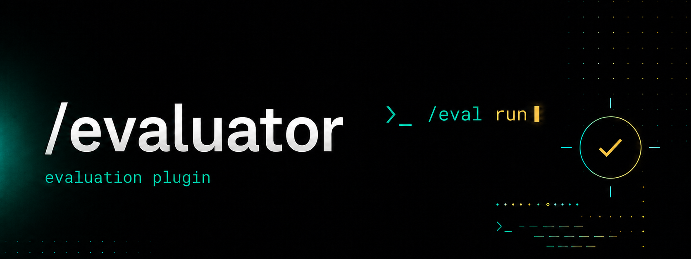

# evaluator

`/evaluator` is a ChatHaikuCLI plugin for running benchmark tests against the currently selected model endpoint.

It loads `.jsonl` test files, detects the test format, sends each prompt to the active ChatHaikuCLI endpoint with deterministic evaluation settings, scores the model reply, and writes a detailed JSON result file.

Evaluator now supports two test formats:

- `mcqa` — the original multiple-choice format used by Featherweight and older evaluator tests.
- `open_ended` — plain open-ended questions where the model reply is expected to contain the answer text.

For backwards compatibility, any test file without a `test_format` field is treated as the original `mcqa` format.

## What it does

- Discovers benchmark files automatically from `plugins/evaluator/tests/`
- Runs one test file or every available test file
- Supports legacy multiple-choice QA tests
- Supports flagged open-ended QA tests
- Defaults unflagged test files to the original multiple-choice format
- Scores multiple-choice questions with answers from `A` through `Z`
- Accepts MCQA answers as either letters or 0-indexed integers in the test file
- Scores open-ended questions by checking whether the reply contains the expected answer text
- Supports optional answer aliases for open-ended questions
- Supports optional per-question categories for category-level breakdowns
- Saves structured JSON results to `plugins/evaluator/results/`
- Saves partial results if a run is interrupted with `Ctrl-C`
- Seeds an example mini-eval the first time it loads if no tests exist yet
- Works through the normal ChatHaikuCLI plugin system
- Provides both `/evaluator` and `/eval` command aliases

## Requirements

Evaluator is a plugin for the ChatHaikuCLI developer client.

You need:

- ChatHaikuCLI with plugin support
- Python 3.8 or newer
- A reachable Rootcomputer-compatible chat endpoint
- The `evaluator.py` plugin file placed in the ChatHaikuCLI `plugins/` directory

The plugin itself uses only Python standard-library modules:

- `argparse`
- `json`
- `os`
- `re`
- `time`

No package installation is required.

## Install

Place the plugin file here:

```text
ChatHaikuCLI/
├─ chathaiku_dev.py
└─ plugins/
   └─ evaluator.py
```

Start the developer client:

```bash
python chathaiku_dev.py
```

List loaded plugins:

```text
/plugin
```

Show the Evaluator help text:

```text
/plugin help evaluator
```

or:

```text
/evaluator
```

If the client was already running when you copied the plugin file into `plugins/`, reload plugins without restarting:

```text
/plugin reload
```

## Generated folders

When the plugin loads, it creates the evaluator workspace relative to the plugin file:

```text
plugins/
├─ evaluator.py
└─ evaluator/
   ├─ tests/
   └─ results/
```

`tests/` is where benchmark `.jsonl` files go.

`results/` is where scored result `.json` files are written.

If `tests/` has no `.jsonl` files on first load, the plugin creates:

```text
plugins/evaluator/tests/example.jsonl
```

That file is only seeded when the test directory is empty, so reloading the plugin will not overwrite existing tests.

## Quick start

Start ChatHaikuCLI's developer client:

```bash
python chathaiku_dev.py
```

Check that Evaluator is loaded:

```text
/plugin
```

List available tests:

```text
/evaluator list
```

Inspect a test before running it:

```text
/evaluator info example
```

Run the seeded example test:

```text
/evaluator run example
```

Run every test in the test directory:

```text
/evaluator run-all
```

Show recent results:

```text
/evaluator results
```

Show the latest result for one test:

```text
/evaluator results example
```

The shorter alias works the same way:

```text
/eval run example
```

## Commands

| Command | Description |
|---|---|
| `/evaluator` | Show usage, test directory, result directory, and test format information. |
| `/evaluator help` | Show the same help output. |
| `/evaluator list` | List `.jsonl` test files in `plugins/evaluator/tests/`, including detected format. |
| `/evaluator info <test>` | Show test metadata, detected format, question count, categories, and a sample question. |
| `/evaluator run <test> [flags]` | Run one test file. |
| `/evaluator run-all [flags]` | Run every `.jsonl` test file in `tests/`. Mixed MCQA and open-ended suites are supported. |
| `/evaluator results` | List recent result JSON files. |
| `/evaluator results <test>` | Show the latest result file for a specific test. |
| `/eval ...` | Alias for `/evaluator ...`. |

## Run flags

| Flag | Description |
|---|---|
| `--limit N` | Stop after the first `N` questions. |
| `--temp F` | Override temperature. Default is `0.0`. |
| `--max-new N` | Override `max_new_tokens`. Default is `20`. Open-ended tests may benefit from a slightly larger value. |
| `--no-save` | Run the test without writing a result file. |
| `--verbose` | Print every question outcome inline. |

Examples:

```text
/evaluator run example --limit 10
/evaluator run example --temp 0.2 --max-new 32
/evaluator run example --verbose
/evaluator run example --no-save
/evaluator run-all --limit 25
```

For open-ended tests, a little extra generation room can help if the model tends to answer in full sentences:

```text
/evaluator run featherweight_open_ended --max-new 40 --verbose
```

## Evaluation sampling

Evaluator overrides normal chat sampling during benchmark runs so the model is scored under stable conditions.

Default evaluation settings:

```json
{
  "temperature": 0.0,
  "top_p": 1.0,
  "top_k": 1,
  "max_new_tokens": 20,
  "repetition_penalty": 1.0,
  "no_repeat_ngram": 0
}
```

When `--temp` is `0.0`, the plugin also uses `top_k: 1` to force hard-greedy decoding even if a server treats zero temperature as a small nonzero value.

When `--temp` is greater than `0.0`, the plugin uses `top_k: 0`.

## Test file format

Each test is a JSONL file. Put test files in:

```text
plugins/evaluator/tests/
```

Each non-empty line must be one JSON object.

The first line may be an optional metadata header:

```json
{"_meta": true, "name": "Arithmetic Smoke Test", "description": "Short arithmetic check.", "test_format": "mcqa"}
```

The canonical format flag is:

```json
"test_format": "mcqa"
```

or:

```json
"test_format": "open_ended"
```

If `test_format` is omitted, Evaluator treats the file as `mcqa`. This preserves compatibility with older tests and the original Featherweight multiple-choice JSONL.

## Format: `mcqa`

`mcqa` is the original evaluator format. It is also the default for every unflagged test file.

Metadata header:

```json
{"_meta": true, "name": "Mini General Eval", "description": "Five basic multiple-choice questions.", "test_format": "mcqa"}
```

Question record:

```json
{"id": "math1", "category": "math", "question": "What is 7 multiplied by 8?", "choices": ["54", "55", "56", "63"], "answer": "C"}
```

Required fields:

| Field | Type | Description |
|---|---|---|
| `question` | string | The question shown to the model. |
| `choices` | array of strings | Answer choices. Must contain 2 to 26 choices. |
| `answer` | string or integer | Correct answer as a letter, such as `"C"`, or a 0-indexed integer, such as `2`. |

Optional fields:

| Field | Type | Description |
|---|---|---|
| `id` | string | Stable question identifier used in result details. |
| `category` | string | Category label used for breakdowns. |

A complete MCQA test file:

```jsonl
{"_meta": true, "name": "Mini General Eval", "description": "Five questions across basic categories.", "test_format": "mcqa"}
{"id": "geo1", "category": "geography", "question": "What is the capital of France?", "choices": ["Berlin", "Paris", "Madrid", "Rome"], "answer": "B"}
{"id": "math1", "category": "math", "question": "What is 7 multiplied by 8?", "choices": ["54", "55", "56", "63"], "answer": "C"}
{"id": "sci1", "category": "science", "question": "Which planet is closest to the sun?", "choices": ["Venus", "Earth", "Mercury", "Mars"], "answer": "C"}
{"id": "lang1", "category": "language", "question": "Which of the following is a verb?", "choices": ["happy", "quickly", "run", "blue"], "answer": "C"}
{"id": "hist1", "category": "history", "question": "In what year did World War II end in Europe?", "choices": ["1942", "1945", "1948", "1950"], "answer": "B"}
```

## Format: `open_ended`

`open_ended` is for regular question-answer prompts without visible choices. It must be enabled with the metadata flag:

```json
{"_meta": true, "name": "Open QA Smoke Test", "description": "Plain question-answer evaluation.", "test_format": "open_ended"}
```

Question record:

```json
{"id": "geo1", "category": "geography", "question": "What is the capital of France?", "expected_answer": "Paris"}
```

Required fields:

| Field | Type | Description |
|---|---|---|
| `question` | string | The open-ended question shown to the model. |
| `expected_answer` | string or array of strings | Accepted answer text. The reply is scored correct if it contains one accepted answer. |

Optional fields:

| Field | Type | Description |
|---|---|---|
| `id` | string | Stable question identifier used in result details. |
| `category` | string | Category label used for breakdowns. |
| `prompt` | string | Full prompt override. If present, Evaluator sends this exact prompt instead of formatting `question`. |

A complete open-ended test file:

```jsonl
{"_meta": true, "name": "Open QA Mini Eval", "description": "Five open-ended basic questions.", "test_format": "open_ended"}
{"id": "geo1", "category": "geography", "question": "What is the capital of France?", "expected_answer": "Paris"}
{"id": "math1", "category": "math", "question": "What is 7 multiplied by 8?", "expected_answer": "56"}
{"id": "sci1", "category": "science", "question": "Which planet is closest to the sun?", "expected_answer": "Mercury"}
{"id": "lang1", "category": "language", "question": "What part of speech is the word run in the sentence I run daily?", "expected_answer": "verb"}
{"id": "hist1", "category": "history", "question": "In what year did World War II end in Europe?", "expected_answer": "1945"}
```

Open-ended questions can also include accepted aliases:

```jsonl
{"_meta": true, "name": "Alias Example", "test_format": "open_ended"}
{"id": "country1", "question": "What country is commonly abbreviated as the USA?", "expected_answer": ["United States", "United States of America", "USA"]}
```

## Prompt format

For MCQA tests, Evaluator formats every question like this:

```text
{question}

A) {choice_1}
B) {choice_2}
C) {choice_3}
D) {choice_4}

Answer with just the letter of the correct choice.
```

For open-ended tests, Evaluator formats every question like this:

```text
{question}

Answer directly and concisely.
```

If an open-ended question record includes a `prompt` field, Evaluator sends that exact string instead. This is useful for datasets that already store prompt text in a `user: ...\nbot:` shape:

```json
{"id": "geo1", "question": "What is the capital of France?", "prompt": "user: What is the capital of France?\nbot:", "expected_answer": "Paris"}
```

The prompt templates are intentionally simple and can be edited directly in `evaluator.py`:

- `DEFAULT_PROMPT_TEMPLATE`
- `OPEN_ENDED_PROMPT_TEMPLATE`

## Answer parsing and scoring

### MCQA scoring

Evaluator asks for a letter answer, but it also handles common model behaviors.

Parsing order:

1. Parenthesized answers, such as `(A)`
2. Direct answer patterns, such as `Answer: A` or `answer is A`
3. Replies that start with a letter, such as `A)` or `A.`
4. Choice-text matching, such as returning `Paris` when choice `B` is `Paris`
5. Any standalone valid answer letter
6. The first non-whitespace character, if it is a valid answer letter

If no valid answer is found, the result is counted as a parse error.

Choice-text matching uses case-insensitive, word-boundary-aware matching so short answer choices do not accidentally match inside longer words or numbers.

### Open-ended scoring

Open-ended scoring is intentionally simple and deterministic. The model reply is marked correct when the normalized reply contains one accepted expected answer string.

Normalization is case-insensitive and punctuation-tolerant. It also uses token/phrase boundaries so short answers do not match inside longer words.

Examples:

| Expected answer | Model reply | Result |
|---|---|---|
| `Paris` | `The answer is Paris.` | Correct |
| `1945` | `World War II ended in Europe in 1945.` | Correct |
| `run` | `The word is running.` | Incorrect |
| `United States` | `The United States of America.` | Correct |

Open-ended misses are counted as incorrect answers, not parse errors. Parse errors are mainly meaningful for MCQA letter extraction.

## Results

Results are saved as JSON files in:

```text
plugins/evaluator/results/
```

File names use the test base name plus a timestamp:

```text
example_20260614T003015.json
```

Each result includes:

| Field | Description |
|---|---|
| `test` | Test file name. |
| `test_name` | Optional name from the `_meta` record. |
| `test_format` | Detected test format: `mcqa` or `open_ended`. |
| `model` | Model name discovered from the host health state, or `unknown` if unavailable. |
| `endpoint` | Active ChatHaikuCLI server endpoint. |
| `timestamp` | Local run timestamp. |
| `params` | Evaluation sampling parameters. |
| `prompt_template` | Prompt template used for the run. |
| `used_prompt_override` | Whether any open-ended item used its own `prompt` field. |
| `total` | Number of scored questions. |
| `answered` | Number of questions with parseable model answers. For open-ended tests this usually equals `total`. |
| `correct` | Correct answer count. |
| `incorrect` | Incorrect answer count excluding MCQA parse errors. |
| `parse_errors` | Number of unparseable MCQA replies. |
| `accuracy` | Correct divided by total. |
| `accuracy_parsed_only` | Correct divided by parseable answers. |
| `elapsed_seconds` | Wall-clock runtime. |
| `by_category` | Category-level totals and accuracy. |
| `interrupted` | Whether the run was interrupted. |
| `details` | Per-question scoring records and raw model replies. |

MCQA detail records include the question ID, category, format, question text, choices, expected letter, predicted letter, correctness, and raw model response.

Open-ended detail records include the question ID, category, format, question text, expected answer or answer aliases, matched answer if found, correctness, and raw model response.

## Reading results in chat

List recent result files:

```text
/evaluator results
```

Show the latest result for a test:

```text
/evaluator results example
```

The command prints the file name, test name, detected format, model, endpoint, timestamp, score, parse error count, and category breakdown when available.

## Running mixed suites

Drop multiple `.jsonl` files into `plugins/evaluator/tests/`:

```text
plugins/evaluator/tests/
├─ featherweight.jsonl
├─ featherweight_open_ended.jsonl
├─ arithmetic.jsonl
└─ reasoning.jsonl
```

Run them all:

```text
/evaluator run-all
```

Evaluator detects each file's format independently, so legacy MCQA files and flagged open-ended files can run in the same suite.

Use `Ctrl-C` to stop a long run. Completed questions are preserved in a partial result file unless `--no-save` is active.

## Working with endpoints

Evaluator scores the model behind the current ChatHaikuCLI endpoint.

Switch endpoints in the developer client before running an eval:

```text
/endpoint http://localhost:8000
/ping
/evaluator run example
```

The plugin sends one-off chat requests through the host client's plugin context. It does not modify the visible conversation history while it runs benchmark questions.

## Practical workflow

A normal evaluation loop looks like this:

```text
/plugin reload
/evaluator list
/evaluator info example
/endpoint http://localhost:8000
/ping
/evaluator run example --verbose
/evaluator results example
```

For quick regression checks during model development:

```text
/evaluator run-all --limit 20
```

For a full deterministic run:

```text
/evaluator run-all
```

For exploratory sampling behavior:

```text
/evaluator run reasoning --temp 0.2 --max-new 32 --verbose
```

For open-ended answer containment checks:

```text
/evaluator run featherweight_open_ended --max-new 40 --verbose
```

## Designing good tests

For MCQA tests, keep each question answerable from the choices alone. Avoid ambiguous wording, overlapping choices, and questions where several choices are arguably correct.

For open-ended tests, keep expected answers short and specific. Use answer aliases when a correct response could reasonably use different wording.

Good open-ended alias example:

```jsonl
{"id": "q1", "category": "geography", "question": "What country is Tokyo in?", "expected_answer": ["Japan", "Nippon"]}
```

Use `category` consistently if you want useful breakdowns:

```jsonl
{"id": "q1", "category": "math", "question": "...", "choices": ["..."], "answer": "A"}
{"id": "q2", "category": "math", "question": "...", "choices": ["..."], "answer": "C"}
{"id": "q3", "category": "logic", "question": "...", "choices": ["..."], "answer": "B"}
```

Prefer stable IDs. They make it easier to compare result files across model versions.

## Backwards compatibility notes

This update is additive.

Existing MCQA files still work unchanged:

```jsonl
{"_meta": true, "name": "Old MCQA Test"}
{"id": "q1", "question": "What is 2 + 2?", "choices": ["3", "4", "5", "6"], "answer": "B"}
```

Because there is no `test_format`, the plugin treats the file as `mcqa`.

Open-ended files must explicitly declare:

```json
"test_format": "open_ended"
```

Without that flag, a file missing `choices` will be interpreted as MCQA and fail validation. This is intentional so older tests do not change behavior accidentally.

## Troubleshooting

### `/evaluator list` shows no tests

Add one or more `.jsonl` files to:

```text
plugins/evaluator/tests/
```

Then run:

```text
/plugin reload
/evaluator list
```

### The plugin does not appear in `/plugin`

Confirm the file is directly inside `plugins/`:

```text
plugins/evaluator.py
```

Then reload:

```text
/plugin reload
```

If the plugin still does not load, check the terminal output for an import error.

### A MCQA test fails to load

Evaluator validates every JSONL line before running. Common causes:

- invalid JSON
- missing `question`
- missing `choices`
- fewer than 2 choices
- more than 26 choices
- empty choice strings
- missing `answer`
- answer letter outside the available choice range
- answer integer outside the available 0-indexed range

Use:

```text
/evaluator info <test>
```

to check whether a test loads and to inspect the first question.

### An open-ended test fails to load

Confirm the metadata header includes:

```json
{"_meta": true, "test_format": "open_ended"}
```

Then check that each question has:

- `question`
- `expected_answer`

`expected_answer` can be a single string or a list of accepted strings.

### Results are not being saved

Results are not written when `--no-save` is used. Without that flag, result files are saved to:

```text
plugins/evaluator/results/
```

### MCQA model shows many parse errors

The model is not returning a clear letter or choice text. Try a lower temperature, increase `--max-new` slightly, or adjust the prompt template in `DEFAULT_PROMPT_TEMPLATE`.

### Open-ended model gives correct answers but scores incorrectly

The containment scorer is intentionally strict. Add aliases to `expected_answer` for valid alternate wording:

```json
{"expected_answer": ["United States", "United States of America", "USA"]}
```

You can also inspect raw replies with:

```text
/evaluator run <test> --verbose
/evaluator results <test>
```

### Model name is `unknown`

Evaluator tries to read the model name from the host's cached health state.

If the current endpoint does not expose compatible health data, results still save normally with `model` set to `unknown`.

### Runs are slow

Runtime depends on endpoint latency and the number of questions. Use `--limit` for smoke tests:

```text
/evaluator run-all --limit 10
```

## Data and privacy

Evaluator sends each benchmark question to the currently configured chat endpoint. Do not include private, secret, or sensitive content in test files unless you control the endpoint and understand its logging behavior.

Result files include raw model responses. Review result JSON before publishing or sharing benchmark outputs.
